# Nice Putt Dude

A golf match-tracking web application built as an example project for a database course at the **University of St. Thomas**. The primary goal is to evaluate the Firebase ecosystem — with a particular focus on **Cloud Firestore** — as a backend for a real-time, multi-user application.

## Tech Stack

| Layer | Technology |
|---|---|
| Frontend | Angular 21, Angular Material |
| Database | Cloud Firestore |
| Auth | Firebase Authentication |
| Backend logic | Firebase Cloud Functions (v2) |
| Local dev | Firebase Emulator Suite |

## Running the Application

### Prerequisites

- Node.js 20+
- npm 11+
- Java 21 (required for the Firebase Emulator)
- Firebase CLI: `npm install -g firebase-tools`

### Setup

1. **Install dependencies:**

   ```bash
   npm install
   ```

2. **Configure Firebase credentials:**

   If you are running with the Firebase Emulator, you can skip this step and run the app as-is.
   
   Only configure credentials if you want to run against an online Firebase project. In that case, copy `src/environments/firebase.example.ts` to `src/environments/firebase.ts` and fill in your Firebase project credentials. (The actual `firebase.ts` is not committed to the repository.)

   ```bash
   cp src/environments/firebase.example.ts src/environments/firebase.ts
   ```

### Start against the Firebase Emulator (recommended for development)

1. **Start the emulator** (imports persisted seed data automatically):

   ```bash
   npm run emulator:start
   ```

2. **Start the Angular dev server** connected to the emulator:

   ```bash
   npm run start:emulator
   ```

3. Open [http://localhost:4200](http://localhost:4200).

### Start against production Firebase

```bash
npm start
```

---

## Firebase Emulator

The project uses the Firebase Emulator Suite for local development. For complete documentation, see the [Firebase Emulator Suite docs](https://firebase.google.com/docs/emulator-suite).

The following emulators are configured:

| Emulator | Port |
|---|---|
| Authentication | 9099 |
| Firestore | 8080 |
| Cloud Functions | 5001 |
| Emulator UI | 4000 |

### Starting the emulator

```bash
npm run emulator:start
```

This runs `firebase emulators:start --import=./emulator-data --export-on-exit=./emulator-data`, which:

- Imports the persisted emulator state from `emulator-data/` on startup.
- Automatically exports the current state back to `emulator-data/` when you stop the emulator (Ctrl+C), preserving any changes made during the session.

### Seeding the emulator with test data

To populate the emulator with a fresh set of sample users, courses, matches, and scorecards:

```bash
# Emulator must already be running
npm run emulator:seed
```

Seed data lives in `emulator-seed/seed-data/`.

---

## Cloud Functions

The Firebase Cloud Functions live in the `functions/` directory and are written in TypeScript.

### `updateScoreboard`

**Trigger:** Firestore `onDocumentWritten` — fires on any create, update, or delete of a document in the `scorecards/{scorecardId}` collection.

**Purpose:** Keeps the `scoreboards/{matchId}` document in sync with the current state of all scorecards for a match. When a scorecard changes, the function:

1. Fetches all scorecards for the affected match.
2. Looks up each player's display name (from `publicUsers`) and profile photo (from Firebase Auth).
3. Computes each player's total strokes vs. par and formats the score string (e.g. `+2`, `-1`, `E`).
4. Sorts players by score (lowest first) and assigns finishing places.
5. Writes the resulting leaderboard to `scoreboards/{matchId}`.

This means clients only need a single real-time listener on `scoreboards/{matchId}` — they never have to aggregate scorecards themselves. For a detailed walkthrough of all Firestore query patterns and the full scoreboard data flow, see [docs/dataQueryDetails.md](docs/dataQueryDetails.md).

### Deploying functions

```bash
# Deploy only Cloud Functions
firebase deploy --only functions
```

The `predeploy` hook (defined in `firebase.json`) automatically lints and builds the TypeScript source before each deploy.

---

## ER Diagram

The entity-relationship diagram for the data models lives in [`docs/er-diagram.mmd`](docs/er-diagram.mmd) (Mermaid source) and [`docs/er-diagram.svg`](docs/er-diagram.svg) (rendered SVG).

> **Note:** This is a rough, auto-generated diagram built by Copilot from the TypeScript `.model.ts` files using relationship inference (see [Regenerating the diagram](#regenerating-the-diagram) below). It is not a formal entity-relationship diagram. For detailed diagram types and Mermaid syntax, see the [Mermaid documentation](https://mermaid.js.org/).

[](docs/er-diagram.svg)

_Source: [`docs/er-diagram.mmd`](docs/er-diagram.mmd) — see [Regenerating the diagram](#regenerating-the-diagram) below._

---

### Viewing the diagram

- **GitHub / VS Code** – The `.mmd` file renders automatically in the [Mermaid preview extension](https://marketplace.visualstudio.com/items?itemName=bierner.markdown-mermaid) and on GitHub (paste the contents into a Markdown fenced code block tagged ` ```mermaid `).
- **SVG** – Open `docs/er-diagram.svg` directly in any browser or image viewer.
- **Mermaid Live Editor** – Paste the contents of `docs/er-diagram.mmd` into [mermaid.live](https://mermaid.live).

### Regenerating the diagram

The diagram is generated from the TypeScript model files in `src/app/models/`.

**Dependencies**

| Package | Purpose |
|---|---|
| `typescript` (already a dev dependency) | Parses `*.model.ts` files via the compiler API |
| `@mermaid-js/mermaid-cli` (dev dependency) | Renders the `.mmd` source to `.svg` via headless Chromium |
| `tsx` (already a dev dependency) | Runs the generator script |

**Steps**

```bash
# Install dependencies (only needed once)
npm install

# Regenerate docs/er-diagram.mmd and docs/er-diagram.svg
npm run generate:er
```

The script (`scripts/generate-er-diagram.ts`):
1. Scans every `*.model.ts` file in `src/app/models/`
2. Extracts interfaces using the TypeScript compiler API
3. Infers relationships from type references and `*Id` naming conventions
4. Writes `docs/er-diagram.mmd`
5. Calls `mmdc` (Mermaid CLI) to render `docs/er-diagram.svg`
